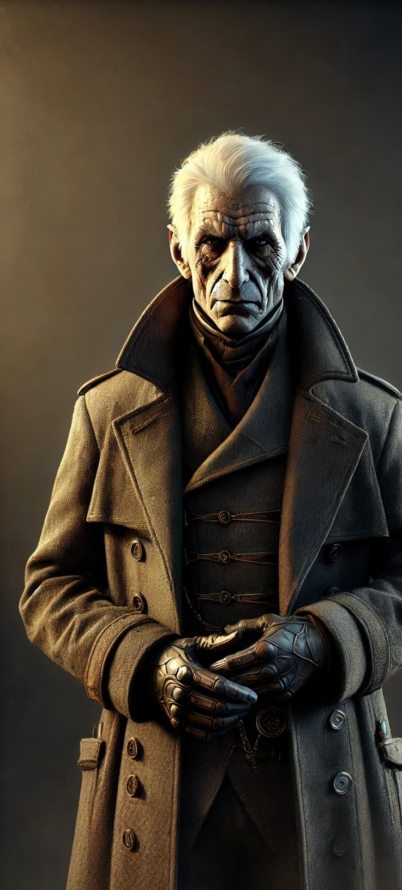

#+title:     Jerry the Joblin
#+author:    Logan Barnett
#+email:     logustus@gmail.com
#+date:      <2025-03-30 Sun>
#+language:  en
#+file_tags:
#+tags:
#+auto_id:   t
#+options:   toc:nil

#+BEGIN_EXPORT html
---
categories: dnd
date: 2025-03-30
layout: default
title: Jerry the Joblin
---
#+END_EXPORT

* Jerry the Joblin
:PROPERTIES:
:VISIBILITY: content
:CUSTOM_ID: jerry-the-joblin
:UNNUMBERED: toc
:END:

** Introduction
:PROPERTIES:
:CUSTOM_ID: jerry-the-joblin--introduction
:END:

This era of [[file:./dirshum.org][Dirshum]] has enjoyed relative peace between the nations for hundreds
of years.  Few people know the true reason for that though.

The orcs of [[Gazgren]] are known for their infighting.  While orcish nature can
account for some of this, there is a darker contribution:  The various nations
of the world back favored orc tribes, and pit the tribes against each other from
behind puppet leaders of the tribes.  The tribes are furnished with weapons,
armor, and taught to wield magic.  Each nation impresses their own style of
warfare upon the tribes.

The nations do this in order to better understand how war might play out on a
larger scale, without having to go into a full scale war to determine the
victor.  A nation whose tribe is doing poorly might be more obsequious at the
diplomatic table, while a nation whose tribe is doing very well might impose
their will upon the others with gusto.  This also helps keep military spending
know where the gaps are, and funds research to find ways to overcome particular
magical techniques.

Lately there's been some middling tribes, notably with no backing nation, that
have risen to power.  They are using mechanical melee weapons and some sort of
combustion powered projectiles (firearms).  This artifice has never been seen
before.  They are doing very well in their fights.  Yet none of the nations have
come forward (in the relevant secret circles) to claim to be operating behind
these tribes.  The only name known is "Jerry the Joblin".

[[Aarion Valor]] has been hired to determine the backer of Jerry, if any, and
Jerry's intent.  Aarion may be contracted to eliminate Jerry, depending on what
is learned.

** Relevances
:PROPERTIES:
:CUSTOM_ID: jerry-the-joblin--relevances
:END:
*** Characters
:PROPERTIES:
:CUSTOM_ID: jerry-the-joblin--relevances--characters
:END:
**** Aarion Valor
:PROPERTIES:
:CUSTOM_ID: jerry-the-joblin--relevances--characters--aarion-valor
:END:

The agent hired collectively by an alliance of nations to uncover the intent of
Jerry the Joblin.

Straight, white hair.  His face is gaunt and he appears heavily aged.  Though
his eyes look keen.  He has a greatcoat and gloves.  No visible weapon can be
seen on him, but he leans upon a metal cane and walks with a limp.  While he is
sharp, he also has an indifference and cold calculation to him.

Aarion is the benefactor of the party and has hired them, both with gold and the
promise of something he knows they will be motivated to pursue, to further his
goals.

**** Amaya Dungees
:PROPERTIES:
:CUSTOM_ID: jerry-the-joblin--relevances--characters--amaya-dungees
:END:

Amaya just recently completed her official priest training for service under the
Raven Queen.  Though her introduction to the topic is a bit of a mystery.  Her
family owes a great debt to [[Aarion Valor]], whom they met in Monrithon, a large
town east of [[Velmarch Outpost]].

Aarion has contracted her to follow and aid the party.

**** Edric Varnell
:PROPERTIES:
:CUSTOM_ID: jerry-the-joblin--relevances--characters--edric-varnell
:END:

Owner of the [[Arcane Provisions]], a potion and potion ingredient shop in
[[Velmarch Outpost]].

*** Organizations
:PROPERTIES:
:CUSTOM_ID: jerry-the-joblin--relevances--organizations
:END:
**** Arcane Provisions
:PROPERTIES:
:CUSTOM_ID: jerry-the-joblin--relevances--organizations--arcane-provisions
:END:

A potion and potion ingredient shop, operating out of a shop-tent in the
marketplace area of Velmarch Outpost.

*** Locations
:PROPERTIES:
:CUSTOM_ID: jerry-the-joblin--relevances--locations
:END:

**** Gazgren
:PROPERTIES:
:CUSTOM_ID: jerry-the-joblin--relevances--locations--gazgren
:END:

A "nation" of orcs.  Though it doesn't have much of its own national identity.

**** Nomasgard
:PROPERTIES:
:CUSTOM_ID: jerry-the-joblin--relevances--locations--nomasgard
:END:

One of the human nations.  Considered to be the most advanced and economically
powerful, it is also a melting pot where many of different species and
nationalities call their homes.  It's very commonplace here.

The campaign takes place in Nomasgard, just along its border with [[Gazgren]].

**** Velmarch Outpost
:PROPERTIES:
:CUSTOM_ID: jerry-the-joblin--relevances--locations--velmarch-outpost
:END:

The outpost is a small town and also military holding that rests along the
border of Gazgren.  This place feels distant from the ideals and laws of
Nomasgard.  It looks like there is a regular shipment of prisoners or perhaps
even slaves en route to Gazgren.

A sort of martial law takes place here.  The town guard are all military, and it
seems like they really don't want to be here - perhaps a punishment stationing.

** Sessions
:PROPERTIES:
:CUSTOM_ID: jerry-the-joblin--sessions
:END:
*** Session 1
:PROPERTIES:
:CUSTOM_ID: jerry-the-joblin--sessions--session-1
:END:
#+include: "../../notes/dm.org::#campaigns--era-of-eras--prophet-assassination--sessions--session-1--public" :only-contents t
*** Session 2
:PROPERTIES:
:CUSTOM_ID: jerry-the-joblin--sessions--session-2
:END:
#+include: "../../notes/dm.org::#campaigns--era-of-eras--prophet-assassination--sessions--session-2--public" :only-contents t
*** Session 3
:PROPERTIES:
:CUSTOM_ID: jerry-the-joblin--sessions--session-3
:END:
#+include: "../../notes/dm.org::#campaigns--era-of-eras--prophet-assassination--sessions--session-3--public" :only-contents t

* COMMENT
:PROPERTIES:
:CUSTOM_ID:
:END:

#  LocalWords:  Amaya Dungees Aarion Joblin Monrithon Velmarch Gazgren orcish
#  LocalWords:  Nomasgard
